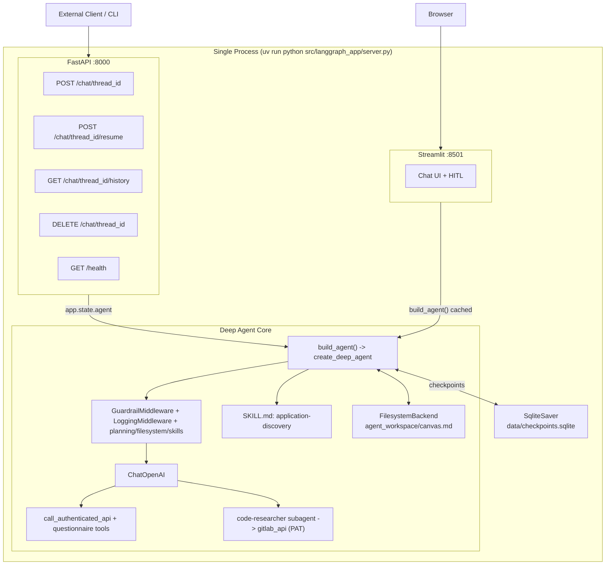

# LangGraph Deep Agent — Legacy-to-AKS Migration

A **LangGraph Deep Agent** that assesses migrating legacy on-prem workloads to managed **Azure Kubernetes Service (AKS)**.

- Built with `deepagents.create_deep_agent` — adds a planning tool, a filesystem, subagents, and the **SKILL.md** progressive-disclosure system on top of a standard LangGraph agent.
- **Skill-driven workflow** — two skills documented in [`docs/skills/`](docs/skills/README.md):
  - **[Application discovery](docs/skills/application-discovery.md)** — APIs + questionnaire → `discovery-artifact.json`
  - **[Migration recommendation](docs/skills/migration-recommendation.md)** — scores + inventory → `migration-recommendation.json`
- Agent instructions live in [`agent_workspace/skills/`](agent_workspace/skills/).
- **FilesystemBackend** persists intermediate results (a `canvas.md` scratchpad plus `servers.json` / `applications.json`) to `agent_workspace/`.
- **Per-run artifact isolation**: a `ScopedArtifactBackend` wrapper transparently writes every run's files under `agent_workspace/runs/<thread_id>/<run_hash>/`, so parallel conversations and consecutive runs never overwrite each other (see [Artifact isolation](#artifact-isolation)).
- **Two authenticated tools**: `call_authenticated_api` (platform/servers API, bearer token) and `gitlab_api` (GitLab REST, PAT) — credentials injected at runtime, never seen by the model.
- **code-researcher subagent** owns the GitLab tool and runs codebase research in isolated context.
- OpenAI model selectable via env (defaults to `gpt-5.2`); SQLite persistence (`SqliteSaver`) so conversations survive restarts.
- **Guardrail** + **Logging** middleware retained; HITL approval via the deep agent's `interrupt_on`.
- **FastAPI** REST API (:8000) and **Streamlit** chat UI (:8501) with approve / edit / reject HITL flow.
- Single-process monolith launcher. Managed entirely with **`uv`**. No Docker.

---

## Quickstart

```bash
uv sync
cp .env.example .env
# edit .env and set OPENAI_API_KEY
```

### Run everything (FastAPI + Streamlit)

```bash
uv run python src/langgraph_app/server.py
```

| Server | URL |
|---|---|
| Streamlit chat UI | http://localhost:8501 |
| FastAPI REST API | http://localhost:8000 |
| Interactive API docs | http://localhost:8000/docs |

### Run servers individually

```bash
# Streamlit only
uv run streamlit run src/langgraph_app/ui/streamlit_app.py

# FastAPI only (with hot-reload)
uv run uvicorn langgraph_app.api:app --reload --port 8000
```

The SQLite checkpoint database is created on first run at `data/checkpoints.sqlite`.

---

## Architecture



### Files

```
src/langgraph_app/
├── agent.py                  # build_agent() -> create_deep_agent (single assembly point)
├── server.py                 # monolith launcher (uvicorn + streamlit subprocess)
├── checkpointer.py           # SqliteSaver factory
├── config.py                 # pydantic-settings -> `settings` singleton
├── run_scope.py              # derive per-turn run_hash (resume-safe)
├── backends/
│   ├── __init__.py           # exports ScopedArtifactBackend
│   └── scoped.py             # per-thread / per-run artifact path scoping
├── api/
│   ├── __init__.py           # FastAPI app + lifespan
│   ├── router.py             # /health + /chat + /artifacts endpoints
│   └── schemas.py            # request / response models
├── tools/
│   ├── __init__.py           # MAIN_TOOLS / RESEARCH_TOOLS / ALL_TOOLS
│   ├── api_tool.py           # get_weather (kept example)
│   ├── bearer_api_tool.py    # call_authenticated_api (bearer token from run config)
│   ├── questionnaire_tool.py # load/save application discovery questionnaire (Excel)
│   └── gitlab_tool.py        # gitlab_api (GitLab PAT from run config)
├── middleware/
│   ├── guardrails.py         # input length / blocklist / iteration cap
│   ├── hitl.py               # HumanInTheLoopMiddleware factory (legacy; HITL now via interrupt_on)
│   └── logging.py            # before_model / after_model tracing
└── ui/
    └── streamlit_app.py      # chat UI + HITL approve/edit/reject

agent_workspace/              # FilesystemBackend root (gitignored except skills/)
├── skills/
│   └── application-discovery/
│       ├── SKILL.md          # discovery workflow (APIs + questionnaire)
│       └── questionnaire.template.xlsx
└── runs/                     # run-scoped artifacts (created at runtime)
    └── <thread_id>/
        └── <run_hash>/
            ├── canvas.md
            ├── servers.json
            └── applications.json
```

Everything is wired in `agent.py`. The `api/` and `ui/` layers are thin consumers of `build_agent()`.

---

## FastAPI endpoints

Base URL: `http://localhost:8000`

Interactive docs with a try-it UI: http://localhost:8000/docs

### `GET /health`

Liveness probe — no auth, no agent call.

```bash
curl http://localhost:8000/health
# {"status":"ok","version":"0.1.0"}
```

### `POST /chat/{thread_id}`

Send a user message. `thread_id` is any string you choose — use a UUID per user/session.

```bash
curl -X POST http://localhost:8000/chat/my-thread-1 \
  -H "Content-Type: application/json" \
  -d '{"message": "What is the weather in Berlin?"}'
```

Response:

```json
{
  "thread_id": "my-thread-1",
  "reply": "...",
  "messages": [...],
  "interrupted": false,
  "interrupt_payload": null
}
```

If `interrupted: true`, the agent paused for human approval. Call `/resume` next.

### `POST /chat/{thread_id}/resume`

Resume a graph paused by `HumanInTheLoopMiddleware`.

```bash
# Approve
curl -X POST http://localhost:8000/chat/my-thread-1/resume \
  -H "Content-Type: application/json" \
  -d '{"decision": "approve"}'

# Edit arguments before approving
curl -X POST http://localhost:8000/chat/my-thread-1/resume \
  -H "Content-Type: application/json" \
  -d '{"decision": "edit", "edited_args": {"latitude": 52.52, "longitude": 13.41}}'

# Reject
curl -X POST http://localhost:8000/chat/my-thread-1/resume \
  -H "Content-Type: application/json" \
  -d '{"decision": "reject"}'
```

### `GET /chat/{thread_id}/history`

Replay the full conversation from SQLite.

```bash
curl http://localhost:8000/chat/my-thread-1/history
```

### `DELETE /chat/{thread_id}`

Wipe all checkpoints for a thread (permanent).

```bash
curl -X DELETE http://localhost:8000/chat/my-thread-1
# {"deleted":"my-thread-1"}
```

### `GET /chat/{thread_id}/artifacts`

List the artifact files a thread has produced, across all of its run folders.

```bash
curl http://localhost:8000/chat/my-thread-1/artifacts
# {"thread_id":"my-thread-1","artifacts":[{"path":"<run_hash>/canvas.md","run_hash":"<run_hash>","size":1234,"modified_at":"..."}]}
```

### `GET /chat/{thread_id}/artifacts/{artifact_path}`

Fetch the content of a single artifact (path is relative to the thread's artifact root, e.g. `<run_hash>/canvas.md`). Binary files are returned base64-encoded.

```bash
curl http://localhost:8000/chat/my-thread-1/artifacts/<run_hash>/canvas.md
```

---

## Configuration

All settings come from environment variables (or a `.env` file at the project root). See [`.env.example`](.env.example).

| Variable               | Default                              | Purpose                                                   |
| ---------------------- | ------------------------------------ | --------------------------------------------------------- |
| `OPENAI_API_KEY`       | _required_                           | Auth for `ChatOpenAI`.                                    |
| `MODEL_NAME`           | `gpt-5.2`                            | OpenAI model identifier.                                  |
| `TEMPERATURE`          | `0.2`                                | Sampling temperature.                                     |
| `DB_PATH`              | `data/checkpoints.sqlite`            | SQLite checkpoint file.                                   |
| `WORKSPACE_DIR`        | `agent_workspace`                    | FilesystemBackend root; skills load from `<dir>/skills`.  |
| `ARTIFACTS_ISOLATION`  | `true`                               | Isolate each run's artifacts under `<runs_root>/<thread_id>/<run_hash>/`. |
| `ARTIFACTS_RUNS_ROOT`  | `/runs`                              | Virtual root (under `WORKSPACE_DIR`) for run-scoped artifact folders. |
| `API_BEARER_TOKEN`     | _empty_                              | Fallback bearer token for the platform API (headless).   |
| `GITLAB_TOKEN`         | _empty_                              | Fallback GitLab PAT for `gitlab_api` (headless).          |
| `GITLAB_BASE_URL`      | `https://gitlab.com/api/v4`          | GitLab REST API base URL.                                 |
| `SYSTEM_PROMPT`        | AKS migration assistant              | Base system prompt.                                       |
| `MAX_ITERATIONS`       | `25`                                 | Guardrail: hard cap on model calls per user turn.         |
| `MAX_INPUT_CHARS`      | `8000`                               | Guardrail: reject user turns longer than this.            |
| `GUARDRAIL_BLOCKLIST`  | _empty_                              | Comma-separated, case-insensitive substring blocklist.    |
| `HITL_TOOLS`           | `call_authenticated_api`             | Comma-separated tool names that pause for human approval. |
| `LOG_LEVEL`            | `INFO`                               | Standard Python log level.                                |

> The Streamlit sidebar has a **Bearer token** and a **GitLab PAT** field. Tokens entered there are injected per-session through the run config and take precedence over `API_BEARER_TOKEN` / `GITLAB_TOKEN`, which exist only as fallbacks for headless API callers.

---

## Middleware

Order matters — outer middleware wraps inner.

### 1. `GuardrailMiddleware` (custom)

- `before_agent`: rejects fresh user input that is too long or matches the blocklist. Short-circuits with `jump_to: "end"` and a polite refusal message.
- `before_model`: caps `AIMessage` count per user turn (since the latest human message) to prevent runaway loops.

### 2. `LoggingMiddleware` (custom)

- `before_model`: logs message count and a preview of the last user message.
- `after_model`: logs elapsed time, token usage (`AIMessage.usage_metadata`), tool-call count, and a preview of the assistant response.

Uses the stdlib `logging` module — pipe it anywhere (stdout, files, structured aggregators).

### 3. Human-in-the-loop (deep agent `interrupt_on`)

`build_agent()` passes `interrupt_on={name: True for name in settings.hitl_tools}` to `create_deep_agent` (same `HumanInTheLoopMiddleware` under the hood).

- Pauses the graph **before** any tool listed in `HITL_TOOLS` is executed.
- Surfaces an `__interrupt__` payload.
- **Streamlit UI**: renders Approve / Edit / Reject buttons.
- **FastAPI**: returns `interrupted: true` in the response; client calls `POST /chat/{thread_id}/resume`.

---

## Application discovery skill

The end-to-end workflow lives in [`agent_workspace/skills/application-discovery/SKILL.md`](agent_workspace/skills/application-discovery/SKILL.md). The deep agent reads it on demand (progressive disclosure) when a prompt matches the skill's `description`, then follows its steps:

1. Collect and validate the user's **AA number** (e.g. `AA12345`).
2. `GET` the **servers** endpoint via `call_authenticated_api`; save to `/servers.json`.
3. `GET` the **applications-per-server** endpoint; save to `/applications.json`.
4. Load the questionnaire via `load_application_questionnaire`; collect each unanswered question via `ask_user` (renders a dropdown or text field in the UI).
5. Persist each answer with `save_questionnaire_answer` to a per-AA Excel workbook under `questionnaires/`.
6. Append API and questionnaire findings to `/canvas.md` and summarize for the user.

**To customize questions:** edit `questionnaire.template.xlsx` in the skill folder (columns: `Question`, `DropDownValues`, `Answer`). **To use real APIs:** open `SKILL.md` and replace the dummy endpoints with your platform URLs.

**Live progress UI:** each skill can define execution phases in `phases.json` (see [`application-discovery/phases.json`](agent_workspace/skills/application-discovery/phases.json)). The Streamlit chat shows a step list (done / in progress / waiting / pending) that updates live during the run via `SkillProgressMiddleware`.

## Tools and credentials

| Tool | Used by | Auth | Credential source |
|------|---------|------|-------------------|
| `call_authenticated_api` | main agent | `Authorization: Bearer <token>` | Streamlit "Bearer token" field, else `API_BEARER_TOKEN` |
| `load_application_questionnaire` | main agent | none | — |
| `save_questionnaire_answer` | main agent | none | — |
| `ask_user` | main agent | none | Pauses for structured user input (dropdown or text) via UI interrupt |
| `gitlab_api` | code-researcher subagent | `PRIVATE-TOKEN: <pat>` | Streamlit "GitLab PAT" field, else `GITLAB_TOKEN` |
| `get_weather` | (kept example) | none | — |

Both authenticated tools receive a `RunnableConfig` parameter that LangChain injects at runtime and hides from the model, so the LLM never generates or sees the token — each tool reads it from the run config's `configurable` (`bearer_token` / `gitlab_token`).

To add **more** tools: create a module in `tools/`, then add it to `MAIN_TOOLS`, `RESEARCH_TOOLS`, or `ALL_TOOLS` in [`src/langgraph_app/tools/__init__.py`](src/langgraph_app/tools/__init__.py). If a tool is sensitive, add its name to `HITL_TOOLS` so the deep agent's `interrupt_on` gates it.

---

## Adding new middleware

Drop a new module in `src/langgraph_app/middleware/`, subclass `langchain.agents.middleware.AgentMiddleware` (or use the `@before_model` / `@after_model` / `@wrap_model_call` decorators), export it from `middleware/__init__.py`, and append it to the `middleware=[...]` list in `agent.py`.

Middleware hook reference:

- `before_agent(state, runtime)` — once per invocation, before the agent loop starts.
- `before_model(state, runtime)` — before every model call.
- `after_model(state, runtime)` — after every model response.
- `after_agent(state, runtime)` — once per invocation, after the loop ends.
- `wrap_model_call(...)` / `wrap_tool_call(...)` — wrap a single call (retries, fallbacks, transforms).

Return `{"jump_to": "end"}` (or `"model"`, `"tools"`) from any hook to short-circuit the graph.

---

## How persistence works

The agent is compiled with `SqliteSaver(sqlite3.connect(DB_PATH, check_same_thread=False))`. Every node execution writes a checkpoint keyed by `(thread_id, checkpoint_id)`.

Both the Streamlit UI and the FastAPI layer share the **same SQLite file**. A conversation started via the API can be continued in the browser and vice versa — as long as the same `thread_id` is used.

> SQLite is great for local dev and single-process deployments. For multi-worker production, switch to `PostgresSaver` — only `checkpointer.py` needs to change.

---

## Artifact isolation

Checkpoints isolate *conversation state* per `thread_id`, but the agent's scratch
files (`canvas.md`, `servers.json`, ...) are written through the filesystem
backend, which by default uses one shared directory. That means two
conversations — or two consecutive runs of the same conversation — would
overwrite each other's files.

`ScopedArtifactBackend` ([`backends/scoped.py`](src/langgraph_app/backends/scoped.py))
wraps the `FilesystemBackend` and transparently rewrites artifact paths:

```
agent writes        ->  on disk
/canvas.md          ->  agent_workspace/runs/<thread_id>/<run_hash>/canvas.md
/servers.json       ->  agent_workspace/runs/<thread_id>/<run_hash>/servers.json
/skills/...         ->  agent_workspace/skills/...        (shared, passthrough)
```

- `thread_id` comes from the run config (`configurable.thread_id`) — deterministic
  and safe for parallel runs.
- `run_hash` is supplied by the caller per turn. The API
  ([`api/router.py`](src/langgraph_app/api/router.py)) and the Streamlit UI
  ([`ui/views/chat.py`](src/langgraph_app/ui/views/chat.py)) derive it from the
  turn index via [`run_scope.py`](src/langgraph_app/run_scope.py), so a HITL
  **resume** keeps the same `run_hash` as the interrupted turn, while a new
  message gets a fresh one. Asking for the same skill again later therefore
  produces a separate folder.

Skills keep writing simple paths like `/canvas.md` — no skill changes are needed
for isolation. The only case a skill handles itself is running the *same* skill
twice within a single response/turn (nest under `/skill-name/`, `/skill-name-2/`,
... — documented in the skill's `## Artifacts` section).

Set `ARTIFACTS_ISOLATION=false` to restore the legacy single shared workspace.

For the full design, behavior matrix, and edge cases, see
[`docs/artifact-maintenance-system.md`](docs/artifact-maintenance-system.md).

### Swapping the storage target

`ScopedArtifactBackend` and `FilesystemBackend` both implement deepagents'
`BackendProtocol`. If you later want queryable, database-backed artifacts instead
of files on disk, swap the backend in [`agent.py`](src/langgraph_app/agent.py) for
deepagents' `StoreBackend` with a thread-scoped namespace
(`namespace=lambda rt: (thread_id, "artifacts")`) — it provides the same
per-thread isolation natively, no wrapper required.

---

## Troubleshooting

- **`OPENAI_API_KEY is not set`** — copy `.env.example` to `.env` and fill it in.
- **Model name errors from OpenAI** — set `MODEL_NAME` to a model your account has access to (e.g., `gpt-5.2`, `gpt-4o`, `gpt-4o-mini`).
- **`ModuleNotFoundError`** — always launch via `uv run ...` from the project root. `uv` handles `PYTHONPATH` via the editable install in `pyproject.toml`.
- **HITL never fires** — the tool name in `HITL_TOOLS` must match the `@tool`-decorated function's name exactly.
- **`database is locked` under heavy concurrency** — expected with SQLite. Move to `PostgresSaver` for production.
- **Port already in use** — change `FASTAPI_PORT` / `STREAMLIT_PORT` constants at the top of `server.py`.

---

## Development scripts

```bash
# Full monolith (FastAPI :8000 + Streamlit :8501)
uv run python src/langgraph_app/server.py

# Streamlit only
uv run streamlit run src/langgraph_app/ui/streamlit_app.py

# FastAPI only with hot-reload
uv run uvicorn langgraph_app.api:app --reload --port 8000

# Headless compile-check (no OpenAI call)
OPENAI_API_KEY=sk-dummy uv run python -c "from langgraph_app.agent import build_agent; build_agent(); print('ok')"
```
