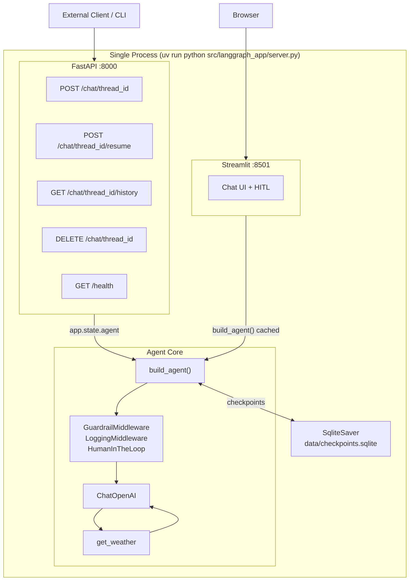

# LangGraph Boilerplate

A modular **LangGraph + OpenAI** agent boilerplate.

- Built with `langchain.agents.create_agent` (LangChain v1.x).
- OpenAI model selectable via env (defaults to `gpt-5.2`).
- SQLite persistence (`SqliteSaver`) so conversations survive restarts.
- Three production-shape middlewares wired in: **Guardrail**, **Logging**, **HumanInTheLoop**.
- One swappable example **API-calling tool** (`get_weather`).
- **FastAPI** REST API on port 8000 — expose the agent to any HTTP client.
- **Streamlit** chat UI on port 8501 — approve / edit / reject HITL flow included.
- Single-process monolith launcher — one command starts both servers.
- Managed entirely with **`uv`**. No Docker.

---

## Quickstart

```bash
uv sync
cp .env.example .env
# edit .env and set OPENAI_API_KEY
```

### Run everything (FastAPI + Streamlit)

```bash
uv run python src/langgraph_app/server.py
```

| Server | URL |
|---|---|
| Streamlit chat UI | http://localhost:8501 |
| FastAPI REST API | http://localhost:8000 |
| Interactive API docs | http://localhost:8000/docs |

### Run servers individually

```bash
# Streamlit only
uv run streamlit run src/langgraph_app/ui/streamlit_app.py

# FastAPI only (with hot-reload)
uv run uvicorn langgraph_app.api:app --reload --port 8000
```

The SQLite checkpoint database is created on first run at `data/checkpoints.sqlite`.

---

## Architecture



### Files

```
src/langgraph_app/
├── agent.py                  # build_agent() — single assembly point
├── server.py                 # monolith launcher (uvicorn + streamlit subprocess)
├── checkpointer.py           # SqliteSaver factory
├── config.py                 # pydantic-settings -> `settings` singleton
├── api/
│   ├── __init__.py           # FastAPI app + lifespan
│   ├── router.py             # /health + /chat endpoints
│   └── schemas.py            # request / response models
├── tools/
│   ├── __init__.py           # exports ALL_TOOLS
│   └── api_tool.py           # get_weather (swap your real API here)
├── middleware/
│   ├── guardrails.py         # input length / blocklist / iteration cap
│   ├── hitl.py               # HumanInTheLoopMiddleware factory
│   └── logging.py            # before_model / after_model tracing
└── ui/
    └── streamlit_app.py      # chat UI + HITL approve/edit/reject
```

Everything is wired in `agent.py`. The `api/` and `ui/` layers are thin consumers of `build_agent()`.

---

## FastAPI endpoints

Base URL: `http://localhost:8000`

Interactive docs with a try-it UI: http://localhost:8000/docs

### `GET /health`

Liveness probe — no auth, no agent call.

```bash
curl http://localhost:8000/health
# {"status":"ok","version":"0.1.0"}
```

### `POST /chat/{thread_id}`

Send a user message. `thread_id` is any string you choose — use a UUID per user/session.

```bash
curl -X POST http://localhost:8000/chat/my-thread-1 \
  -H "Content-Type: application/json" \
  -d '{"message": "What is the weather in Berlin?"}'
```

Response:

```json
{
  "thread_id": "my-thread-1",
  "reply": "...",
  "messages": [...],
  "interrupted": false,
  "interrupt_payload": null
}
```

If `interrupted: true`, the agent paused for human approval. Call `/resume` next.

### `POST /chat/{thread_id}/resume`

Resume a graph paused by `HumanInTheLoopMiddleware`.

```bash
# Approve
curl -X POST http://localhost:8000/chat/my-thread-1/resume \
  -H "Content-Type: application/json" \
  -d '{"decision": "approve"}'

# Edit arguments before approving
curl -X POST http://localhost:8000/chat/my-thread-1/resume \
  -H "Content-Type: application/json" \
  -d '{"decision": "edit", "edited_args": {"latitude": 52.52, "longitude": 13.41}}'

# Reject
curl -X POST http://localhost:8000/chat/my-thread-1/resume \
  -H "Content-Type: application/json" \
  -d '{"decision": "reject"}'
```

### `GET /chat/{thread_id}/history`

Replay the full conversation from SQLite.

```bash
curl http://localhost:8000/chat/my-thread-1/history
```

### `DELETE /chat/{thread_id}`

Wipe all checkpoints for a thread (permanent).

```bash
curl -X DELETE http://localhost:8000/chat/my-thread-1
# {"deleted":"my-thread-1"}
```

---

## Configuration

All settings come from environment variables (or a `.env` file at the project root). See [`.env.example`](.env.example).

| Variable               | Default                              | Purpose                                                   |
| ---------------------- | ------------------------------------ | --------------------------------------------------------- |
| `OPENAI_API_KEY`       | _required_                           | Auth for `ChatOpenAI`.                                    |
| `MODEL_NAME`           | `gpt-5.2`                            | OpenAI model identifier.                                  |
| `TEMPERATURE`          | `0.2`                                | Sampling temperature.                                     |
| `DB_PATH`              | `data/checkpoints.sqlite`            | SQLite checkpoint file.                                   |
| `SYSTEM_PROMPT`        | helpful concise assistant            | Base system prompt.                                       |
| `MAX_ITERATIONS`       | `8`                                  | Guardrail: hard cap on model calls per run.               |
| `MAX_INPUT_CHARS`      | `8000`                               | Guardrail: reject user turns longer than this.            |
| `GUARDRAIL_BLOCKLIST`  | _empty_                              | Comma-separated, case-insensitive substring blocklist.    |
| `HITL_TOOLS`           | `get_weather`                        | Comma-separated tool names that pause for human approval. |
| `LOG_LEVEL`            | `INFO`                               | Standard Python log level.                                |

---

## Middleware

Order matters — outer middleware wraps inner.

### 1. `GuardrailMiddleware` (custom)

- `before_agent`: rejects fresh user input that is too long or matches the blocklist. Short-circuits with `jump_to: "end"` and a polite refusal message.
- `before_model`: caps total `AIMessage` count per run to prevent runaway loops.

### 2. `LoggingMiddleware` (custom)

- `before_model`: logs message count and a preview of the last user message.
- `after_model`: logs elapsed time, token usage (`AIMessage.usage_metadata`), tool-call count, and a preview of the assistant response.

Uses the stdlib `logging` module — pipe it anywhere (stdout, files, structured aggregators).

### 3. `HumanInTheLoopMiddleware` (built-in)

- Pauses the graph **before** any tool listed in `HITL_TOOLS` is executed.
- Surfaces an `__interrupt__` payload.
- **Streamlit UI**: renders Approve / Edit / Reject buttons.
- **FastAPI**: returns `interrupted: true` in the response; client calls `POST /chat/{thread_id}/resume`.

---

## Swapping the example tool for your real API

Open [`src/langgraph_app/tools/api_tool.py`](src/langgraph_app/tools/api_tool.py). It's intentionally tiny:

1. Rename `get_weather` to your tool name. Keep the `@tool` decorator and type hints — the model uses them to decide how to call the tool.
2. Replace the URL, params, and response shaping.
3. Pull any credentials from `langgraph_app.config.settings` (add a new field to `Settings`). **Never** hardcode keys in the tool file.
4. If you add **more** tools, create a new module in `tools/` and append it to `ALL_TOOLS` in [`src/langgraph_app/tools/__init__.py`](src/langgraph_app/tools/__init__.py).
5. If your new tool is sensitive (writes data, sends emails, spends money), add its name to `HITL_TOOLS` in `.env` so HITL gates it.

No other file needs to change — `agent.py` reads `ALL_TOOLS` and `settings.hitl_tools` directly.

---

## Adding new middleware

Drop a new module in `src/langgraph_app/middleware/`, subclass `langchain.agents.middleware.AgentMiddleware` (or use the `@before_model` / `@after_model` / `@wrap_model_call` decorators), export it from `middleware/__init__.py`, and append it to the `middleware=[...]` list in `agent.py`.

Middleware hook reference:

- `before_agent(state, runtime)` — once per invocation, before the agent loop starts.
- `before_model(state, runtime)` — before every model call.
- `after_model(state, runtime)` — after every model response.
- `after_agent(state, runtime)` — once per invocation, after the loop ends.
- `wrap_model_call(...)` / `wrap_tool_call(...)` — wrap a single call (retries, fallbacks, transforms).

Return `{"jump_to": "end"}` (or `"model"`, `"tools"`) from any hook to short-circuit the graph.

---

## How persistence works

The agent is compiled with `SqliteSaver(sqlite3.connect(DB_PATH, check_same_thread=False))`. Every node execution writes a checkpoint keyed by `(thread_id, checkpoint_id)`.

Both the Streamlit UI and the FastAPI layer share the **same SQLite file**. A conversation started via the API can be continued in the browser and vice versa — as long as the same `thread_id` is used.

> SQLite is great for local dev and single-process deployments. For multi-worker production, switch to `PostgresSaver` — only `checkpointer.py` needs to change.

---

## Troubleshooting

- **`OPENAI_API_KEY is not set`** — copy `.env.example` to `.env` and fill it in.
- **Model name errors from OpenAI** — set `MODEL_NAME` to a model your account has access to (e.g., `gpt-5.2`, `gpt-4o`, `gpt-4o-mini`).
- **`ModuleNotFoundError`** — always launch via `uv run ...` from the project root. `uv` handles `PYTHONPATH` via the editable install in `pyproject.toml`.
- **HITL never fires** — the tool name in `HITL_TOOLS` must match the `@tool`-decorated function's name exactly.
- **`database is locked` under heavy concurrency** — expected with SQLite. Move to `PostgresSaver` for production.
- **Port already in use** — change `FASTAPI_PORT` / `STREAMLIT_PORT` constants at the top of `server.py`.

---

## Development scripts

```bash
# Full monolith (FastAPI :8000 + Streamlit :8501)
uv run python src/langgraph_app/server.py

# Streamlit only
uv run streamlit run src/langgraph_app/ui/streamlit_app.py

# FastAPI only with hot-reload
uv run uvicorn langgraph_app.api:app --reload --port 8000

# Headless compile-check (no OpenAI call)
OPENAI_API_KEY=sk-dummy uv run python -c "from langgraph_app.agent import build_agent; build_agent(); print('ok')"
```
