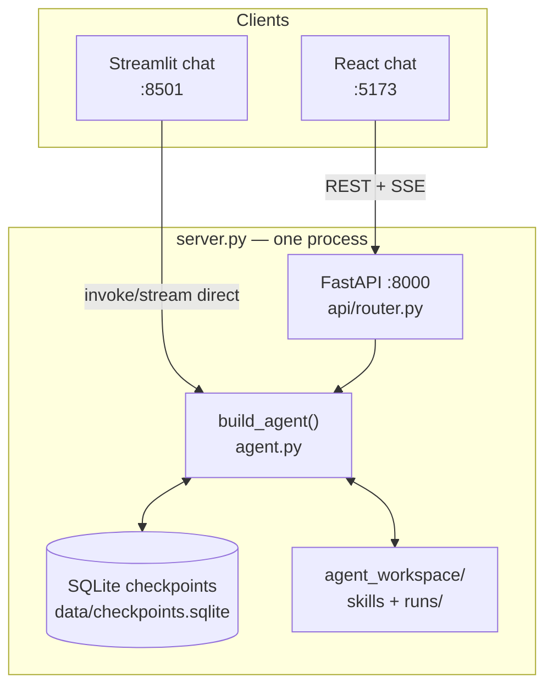
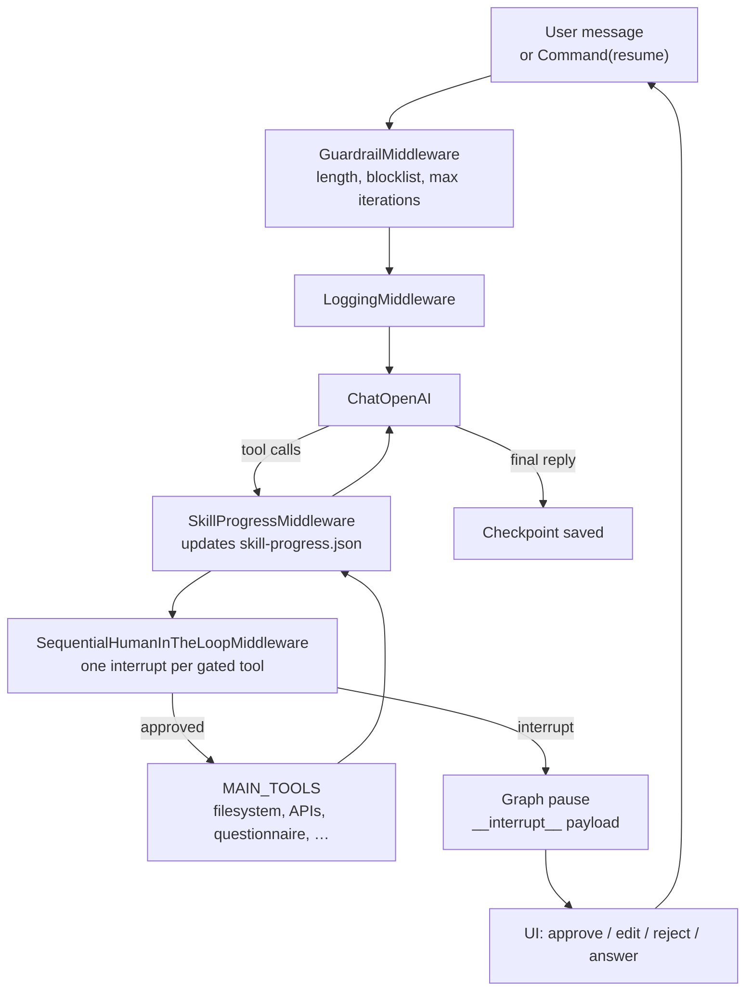
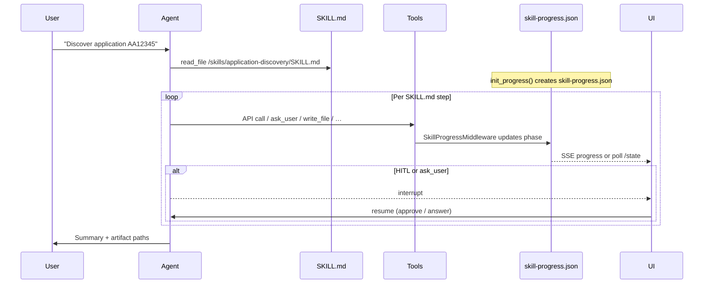
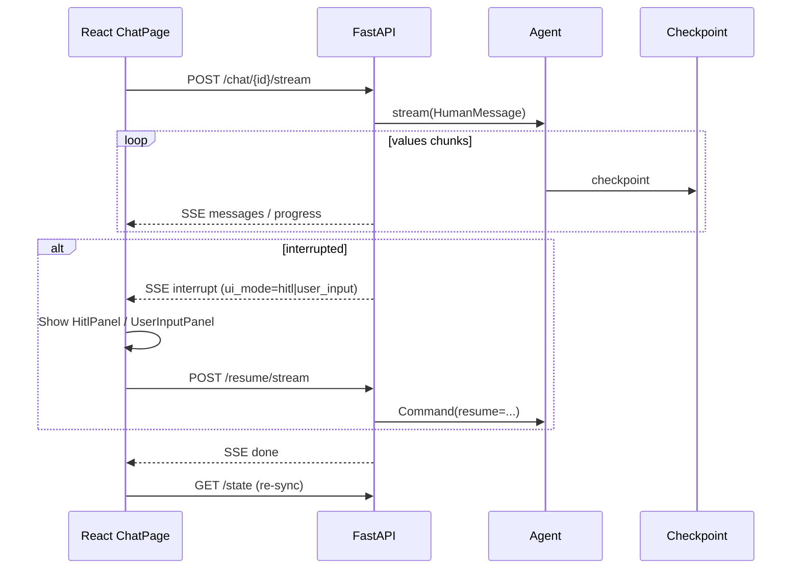
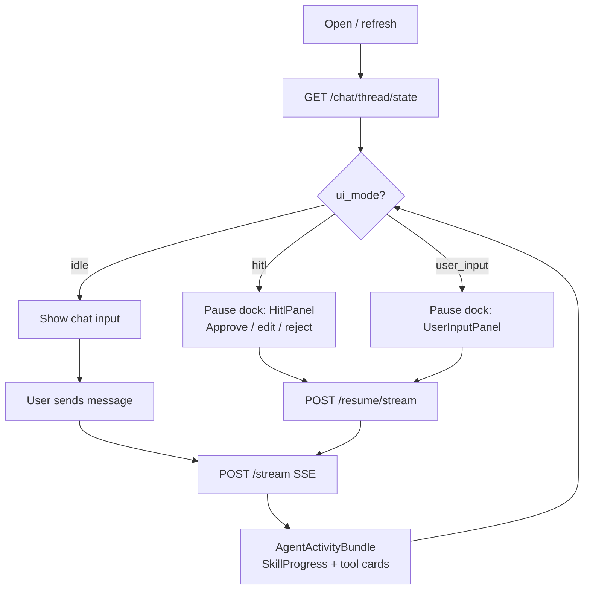
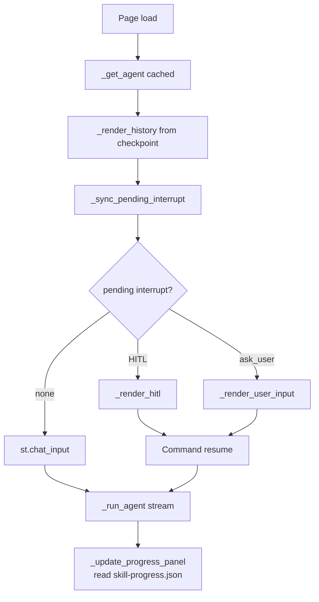
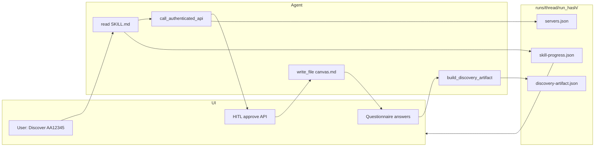

# Architecture — UI, Agent & Skills

This document explains how the **React/Streamlit UIs**, the **LangGraph deep agent**, and the **skill workflows** fit together. For skill-specific runbooks, see [skills/README.md](./skills/README.md).

**Last verified:** 2026-06-12 (against `src/langgraph_app/` + `frontend/`)

---

## 1. System overview

The app is a **single-process monolith** launched by `./start.sh`. One Python process runs FastAPI; it optionally spawns React (Vite) and Streamlit as child processes.



| Layer | Port | Entry | Responsibility |
|-------|------|-------|----------------|
| **FastAPI** | 8000 | `src/langgraph_app/server.py` → `api/__init__.py` | REST + SSE; owns `app.state.agent` |
| **React** | 5173 | `frontend/` | Primary chat UI; syncs via `/chat/{id}/state` |
| **Streamlit** | 8501 | `ui/streamlit_app.py` | Alternate chat UI; calls agent directly |
| **Agent workspace** | — | `agent_workspace/` | Shared skills + per-run artifacts |

**Key principle:** The **agent checkpoint is the source of truth** for messages and interrupts. The UI is thin — it renders agent state; it does not invent HITL or progress.

---

## 2. Deep agent architecture

The agent is assembled once in `build_agent()` (`src/langgraph_app/agent.py`) using **`deepagents.create_deep_agent`**. There are no hand-written LangGraph node files — behavior comes from middleware, tools, and skills.



### What the agent has

| Piece | Where | Notes |
|-------|-------|-------|
| **Model** | `config.py` → `ChatOpenAI` | `OPENAI_API_KEY`, `MODEL_NAME` |
| **Main tools** | `tools/__init__.py` → `MAIN_TOOLS` | API, questionnaire, discovery, migration, `ask_user`, … |
| **Subagent** | `agent.py` | `code-researcher` with `gitlab_api` only |
| **Filesystem** | `FilesystemBackend` + `ScopedArtifactBackend` | Virtual paths under `agent_workspace/` |
| **Skills** | `skills=["/skills"]` | Maps to `agent_workspace/skills/` |
| **Checkpointer** | `checkpointer.py` | `SqliteSaver` at `data/checkpoints.sqlite` |
| **HITL** | `middleware/hitl.py` | Gated tools from `HITL_TOOLS` env |

### Run scope (artifact isolation)

Each **user turn** gets a new `run_hash` derived from `thread_id` + human-message count (`run_scope.py`). Writes go to:

```
agent_workspace/runs/<thread_id>/<run_hash>/
```

HITL and `ask_user` **resumes keep the same `run_hash`** so the agent continues in the same folder.

### Interrupt types

| Type | Trigger | Resume payload | `ui_mode` |
|------|---------|----------------|-----------|
| **HITL** | Gated tool (`write_file`, `call_authenticated_api`, …) | `{ decision: "approve" \| "edit" \| "reject", ... }` | `hitl` |
| **User input** | `ask_user` tool | `{ answer: "..." }` | `user_input` |

Detection lives in `src/langgraph_app/hitl.py` (`is_hitl_interrupt`, `ui_mode_from_interrupt`).

---

## 3. Skills system

Skills are **markdown playbooks** the agent reads at runtime — not separate Python services.

### Layout

```
agent_workspace/skills/
├── application-discovery/
│   ├── SKILL.md              ← agent instructions (progressive disclosure)
│   ├── phases.json           ← phase definitions for progress UI
│   ├── questionnaire.template.xlsx
│   └── discovery-artifact.schema.json
├── migration-recommendation/
│   ├── SKILL.md
│   ├── phases.json
│   └── scores/, target-inventory.csv
└── custom-llm-call/
    └── SKILL.md
```

Shared skill paths (`/skills/...`) are **read-only** and bypass per-run scoping. Run outputs (`canvas.md`, `servers.json`, artifacts) go under `runs/<thread>/<run_hash>/`.

### How a skill runs



### Skill activation flow

1. User prompt matches a skill (e.g. "discover AA12345").
2. System prompt tells the model to **`read_file` on `/skills/<name>/SKILL.md`** first.
3. Reading `SKILL.md` triggers **`init_progress()`** (`skill_progress.py`) if `phases.json` exists.
4. Each tool call updates phases via **`SkillProgressMiddleware`**.
5. Final artifacts (e.g. `discovery-artifact.json`) land in the run folder.

### Built-in skills

| Skill | Phases (high level) | Output |
|-------|---------------------|--------|
| **application-discovery** | collect_aa → discover_servers → discover_applications → questionnaire → build_artifact → summarize | `discovery-artifact.json`, `servers.json`, `applications.json` |
| **migration-recommendation** | load_discovery → load_scores → assess_eligibility → load_inventory → build_recommendation → summarize | `migration-recommendation.json` |

See [skills/README.md](./skills/README.md) for step-by-step runbooks.

### Progress file shape

Path: `agent_workspace/runs/<thread_id>/<run_hash>/skill-progress.json`

The API exposes this via `thread_state_payload()` and SSE `progress` events. Phase statuses: `pending`, `in_progress`, `completed`, `waiting`.

---

## 4. API layer (React ↔ agent bridge)

FastAPI is the **only** path the React UI uses. Canonical snapshot:

**`GET /chat/{thread_id}/state`** → `thread_state_payload()` in `api/helpers.py`

```json
{
  "thread_id": "...",
  "messages": [...],
  "interrupted": true,
  "interrupt_payload": { "action_requests": [...] },
  "ui_mode": "hitl",
  "run_hash": "...",
  "progress": { "skill": "application-discovery", "phases": {...} },
  "phases": [{ "id": "collect_aa", "label": "..." }]
}
```

### Streaming (SSE)

`POST /chat/{thread_id}/stream` and `POST /chat/{thread_id}/resume/stream` emit:

| Event | Purpose |
|-------|---------|
| `start` | `{ run_hash }` for this turn |
| `progress` | Skill phase updates |
| `messages` | Full message list so far |
| `interrupt` | Pause payload + `ui_mode` |
| `done` | Final snapshot (same shape as `/state`) |

Implementation: `src/langgraph_app/api/streaming.py`.



---

## 5. React UI flow

**Entry:** `frontend/src/pages/ChatPage.tsx`  
**API client:** `frontend/src/api/client.ts`

### State model

| State | Source |
|-------|--------|
| `messages` | Checkpoint via `/state` or SSE |
| `uiMode` | `idle` \| `running` \| `hitl` \| `user_input` from agent |
| `pendingInterrupt` | `interrupt_payload` from checkpoint |
| `progress` / `phases` | `skill-progress.json` via API |
| `runHash` | Per-turn hash from `start` / `done` events |
| `threadId` | `localStorage` + sidebar thread list |

### User journey



### Key React components

| Component | Role |
|-----------|------|
| `ChatPage` | Orchestration, thread sync, streaming |
| `Sidebar` | Threads, tokens, HITL auto-approve toggle |
| `HitlPanel` | Approve gated tool calls |
| `UserInputPanel` | Answer `ask_user` prompts |
| `AgentActivityBundle` | Groups progress, tools, pause UI per turn |
| `SkillProgress` | Phase stepper from `skill-progress.json` |
| `TurnToolList` | Tool call cards (running / queued / completed) |
| `MarkdownContent` | GitHub-style agent reply rendering |

### HITL batching

When the agent emits multiple gated `write_file` calls in one turn, **Sequential HITL** pauses once per file. The UI shows the active approval in the pause dock; other pending writes appear as **Queued** in tool cards (`utils/interrupts.ts` → `callMatchesHitlInterrupt`).

---

## 6. Streamlit UI flow

**Entry:** `src/langgraph_app/ui/streamlit_app.py` → `views/chat.py`

Streamlit talks to the **same checkpoint file** but uses its own cached `build_agent()` instance — not FastAPI.



| Concern | Streamlit | React |
|---------|-----------|-------|
| Agent access | Direct `agent.stream()` | Via FastAPI SSE |
| State sync | `agent.get_state()` each rerun | `GET /state` + SSE |
| Progress | Read `skill-progress.json` during stream | SSE `progress` + `/state` |
| HITL auto-approve | `_drain_hitl_auto_approvals` | `drainAutoApprovals` in ChatPage |

Both UIs can continue the **same conversation** if they share a `thread_id` (checkpoints are keyed by thread, not by UI).

---

## 7. End-to-end example: application discovery



1. User sends discovery prompt with bearer token `1234` (mock API).
2. Agent reads `/skills/application-discovery/SKILL.md` → progress init.
3. `ask_user` for AA code → `ui_mode=user_input`.
4. `call_authenticated_api` → HITL → user approves in pause dock.
5. Agent writes `servers.json`, `applications.json`, `canvas.md` under run folder.
6. Questionnaire tools fill answers; `build_discovery_artifact` produces JSON.
7. UI shows phase stepper advancing; final summary in chat.

---

## 8. Key files reference

| Concern | Files |
|---------|-------|
| **Agent assembly** | `src/langgraph_app/agent.py` |
| **Server / launcher** | `src/langgraph_app/server.py`, `start.sh` |
| **Config** | `src/langgraph_app/config.py`, `.env` |
| **Skills (content)** | `agent_workspace/skills/*/SKILL.md`, `phases.json` |
| **Skill progress** | `src/langgraph_app/skill_progress.py`, `middleware/skill_progress.py` |
| **HITL** | `src/langgraph_app/hitl.py`, `middleware/hitl.py` |
| **API + streaming** | `src/langgraph_app/api/router.py`, `streaming.py`, `helpers.py` |
| **React chat** | `frontend/src/pages/ChatPage.tsx`, `frontend/src/api/client.ts` |
| **Streamlit chat** | `src/langgraph_app/ui/views/chat.py` |
| **Artifact scoping** | `src/langgraph_app/backends/scoped.py`, `run_scope.py` |

---

## 9. Related documentation

- [Skills guide](./skills/README.md) — discovery + migration runbooks
- [Application discovery](./skills/application-discovery.md)
- [Migration recommendation](./skills/migration-recommendation.md)
- [Artifact maintenance](./artifact-maintenance-system.md)
- [README](../README.md) — quickstart, env vars, API table
