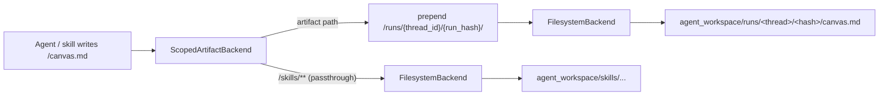

# Artifact Maintenance System

Per-conversation and per-run isolation for the files (artifacts) that the deep
agent and its skills write during a run.

- [Problem](#problem)
- [Goals](#goals)
- [How it works](#how-it-works)
  - [On-disk layout](#on-disk-layout)
  - [Path scoping (`ScopedArtifactBackend`)](#path-scoping-scopedartifactbackend)
  - [The `run_hash` (per-turn id)](#the-run_hash-per-turn-id)
- [What changed](#what-changed)
- [Configuration](#configuration)
- [Browsing artifacts (API)](#browsing-artifacts-api)
- [Behavior matrix](#behavior-matrix)
- [Edge cases and limitations](#edge-cases-and-limitations)
- [Testing / verification](#testing--verification)
- [Future: switching to a database-backed store](#future-switching-to-a-database-backed-store)

---

## Problem

The agent persists intermediate results (`canvas.md`, `servers.json`,
`applications.json`, ...) by calling the filesystem tools, which go through a
deepagents `FilesystemBackend` rooted at `agent_workspace/`.

Before this change, **all runs shared that single directory**:

- Two conversations running in parallel would write to the same `canvas.md` and
  clobber each other.
- Running the same skill twice in one conversation (e.g. two assessments) would
  overwrite the first run's files with the second.
- There was no way to tell which files belonged to which conversation or run.

Note that LangGraph's `SqliteSaver` already isolates **conversation state**
(messages, graph state) per `thread_id` — but that isolation never extended to
the filesystem artifacts.

## Goals

1. Every run stores its artifacts under a key tied to the conversation
   (`thread_id`).
2. The same skill invoked again in the same chat stores its artifacts under a
   different key (a per-run hash), instead of overwriting.
3. Works for both consecutive runs and parallel runs of agents.
4. Skills should not have to change how they write files.

## How it works

A thin wrapper backend, `ScopedArtifactBackend`, sits between the agent's
filesystem tools and the real `FilesystemBackend`. It transparently rewrites the
paths the agent uses so each run gets its own folder, then strips the prefix off
returned paths so the agent never sees the scoping.



The two scope components come from the LangGraph run config
(`get_config()["configurable"]`), which is available at file-write time:

- `thread_id` — identifies the conversation. Deterministic and safe for parallel
  runs (each invocation carries its own thread id).
- `run_hash` — identifies a single user turn. Supplied by the caller (API / UI).

### On-disk layout

```
agent_workspace/
├── skills/                         # shared, read-only (passthrough)
│   └── application-discovery/
│       ├── SKILL.md
│       └── questionnaire.template.xlsx
└── runs/                           # created at runtime
    └── <thread_id>/
        ├── <run_hash_turn_1>/
        │   ├── canvas.md
        │   ├── servers.json
        │   └── applications.json
        └── <run_hash_turn_2>/
            └── canvas.md
```

### Path scoping (`ScopedArtifactBackend`)

Source: [`src/langgraph_app/backends/scoped.py`](../src/langgraph_app/backends/scoped.py)

- Implements deepagents' `BackendProtocol` and delegates to an inner backend.
- **Inbound** (agent path → inner path): paths under a passthrough prefix
  (`/skills`, and the runs root itself) are left unchanged; every other path is
  prefixed with `/runs/<thread_id>/<run_hash>`.
- **Outbound** (inner path → agent path): the scope prefix is stripped from any
  returned `path` (in `write`/`edit` results, `ls`/`glob`/`grep` entries,
  `download`/`upload` responses) so the agent always sees stable paths like
  `/canvas.md`.
- Scope components are sanitized (only `[A-Za-z0-9._-]`, otherwise replaced with
  `_`) to prevent path traversal out of the runs root.
- When the run folder does not exist yet (a fresh run that hasn't written
  anything), `ls("/")` returns an empty listing plus the `/skills` directory
  instead of a confusing "not found" error.
- Only the synchronous methods are implemented; `BackendProtocol` provides async
  wrappers that delegate to them via `asyncio.to_thread` (which copies the
  contextvars, so `get_config()` still resolves).

### The `run_hash` (per-turn id)

Source: [`src/langgraph_app/run_scope.py`](../src/langgraph_app/run_scope.py)

LangGraph does **not** expose a `run_id` in the runtime config, so the per-run
identifier is supplied by the caller. It is derived deterministically:

```python
run_hash = sha1(f"{thread_id}:{turn_index}").hexdigest()[:12]
```

where `turn_index` is the number of human messages that started the turn. This
gives two important properties:

- **New message → new hash.** A later message is a new turn (higher index), so
  asking for the same skill again lands in a different folder.
- **HITL resume → same hash.** A resume continues the interrupted turn without
  adding a new human message, so recomputing from the turn index yields the
  *same* hash and the resumed work lands in the same folder as the interrupted
  call. This avoids splitting one turn's artifacts across two folders.

Callers compute the index from the thread's current state:

- New message: `turn_index = count_human_messages(state)` (the new message is not
  yet in state).
- Resume: `turn_index = count_human_messages(state) - 1` (the triggering message
  is already in state).

## What changed

| File | Change |
| ---- | ------ |
| [`src/langgraph_app/backends/__init__.py`](../src/langgraph_app/backends/__init__.py) | New package; exports `ScopedArtifactBackend`. |
| [`src/langgraph_app/backends/scoped.py`](../src/langgraph_app/backends/scoped.py) | New: the scoping backend wrapper. |
| [`src/langgraph_app/run_scope.py`](../src/langgraph_app/run_scope.py) | New: `count_human_messages()` and `derive_run_hash()`. |
| [`src/langgraph_app/agent.py`](../src/langgraph_app/agent.py) | Wrap the `FilesystemBackend` in `ScopedArtifactBackend` (gated by `ARTIFACTS_ISOLATION`). |
| [`src/langgraph_app/config.py`](../src/langgraph_app/config.py) | New settings: `artifacts_isolation`, `artifacts_runs_root`. |
| [`src/langgraph_app/api/router.py`](../src/langgraph_app/api/router.py) | `_thread_config()` accepts `run_hash`; new-turn and resume configs derive it; new artifact list/fetch endpoints. |
| [`src/langgraph_app/api/schemas.py`](../src/langgraph_app/api/schemas.py) | New: `ArtifactInfo`, `ArtifactListResponse`, `ArtifactContentResponse`. |
| [`src/langgraph_app/ui/views/chat.py`](../src/langgraph_app/ui/views/chat.py) | `_thread_config()` accepts `run_hash`; `_run_agent()` derives it (resume-aware). |
| [`agent_workspace/skills/application-discovery/SKILL.md`](../agent_workspace/skills/application-discovery/SKILL.md) | Application discovery skill with `## Artifacts` section for the same-turn repeat-run case. |
| [`README.md`](../README.md) | Documented the layout, config vars, endpoints, and the `StoreBackend` swap path. |

## Configuration

| Variable | Default | Purpose |
| -------- | ------- | ------- |
| `ARTIFACTS_ISOLATION` | `true` | Wrap the filesystem backend with `ScopedArtifactBackend`. Set `false` to restore the legacy single shared workspace. |
| `ARTIFACTS_RUNS_ROOT` | `/runs` | Virtual root (under `WORKSPACE_DIR`) for run-scoped folders. Files resolve to `<WORKSPACE_DIR><runs_root>/<thread_id>/<run_hash>/...`. |

## Browsing artifacts (API)

Two read-only endpoints expose a thread's artifact folders:

```bash
# List all artifacts for a thread (across run folders)
curl http://localhost:8000/chat/my-thread-1/artifacts
# {"thread_id":"my-thread-1","artifacts":[
#   {"path":"<run_hash>/canvas.md","run_hash":"<run_hash>","size":1234,"modified_at":"..."}]}

# Fetch one artifact's content (binary files come back base64-encoded)
curl http://localhost:8000/chat/my-thread-1/artifacts/<run_hash>/canvas.md
```

The fetch endpoint resolves the requested path under the thread's artifact root
and rejects anything that escapes it (path-traversal guard).

## Behavior matrix

| Scenario | Result |
| -------- | ------ |
| Two conversations (different `thread_id`) run at the same time | Separate `runs/<thread_id>/...` trees — no collision. |
| Same conversation, two separate messages each triggering a skill | Different `run_hash` per turn → different folders. |
| HITL interrupt then resume within one turn | Same `run_hash` → resumed work joins the same folder. |
| Same skill invoked twice within a single response/turn | Same `run_hash`; the skill nests under `/skill-name/`, `/skill-name-2/` (see SKILL.md). |
| `ARTIFACTS_ISOLATION=false` | Legacy behavior: one shared `agent_workspace/`. |

## Edge cases and limitations

- **Same skill twice in one turn** is the one case isolation can't fully
  automate (the turn index is identical). The skill's `## Artifacts` section
  instructs the agent to nest each run under its own subfolder and bump a suffix.
- **Identical-index collisions** cannot happen across turns because the index
  strictly increases with each human message.
- **Existing root-level files** (`research_canvas.md`, `search_results.json`)
  predate this system and are not migrated; they remain where they are.
- The `run_hash` is derived from `thread_id + turn_index`, not message content,
  so it is stable and predictable but not globally unique across threads (it is
  always namespaced under `thread_id`, which makes the full path unique).

## Testing / verification

The implementation was verified with:

- An integration test running `ScopedArtifactBackend` inside a real LangGraph
  node: `/canvas.md` resolved to `runs/<thread>/<hash>/canvas.md`, two runs of
  the same thread stayed isolated, and `/skills` passthrough (ls + download)
  worked.
- A headless build (`build_agent()`), FastAPI app import (artifact routes
  registered), and byte-compilation of all changed modules.

Quick manual check:

```bash
OPENAI_API_KEY=sk-dummy uv run python -c \
  "from langgraph_app.agent import build_agent; build_agent(); print('ok')"
```

## Future: switching to a database-backed store

`ScopedArtifactBackend` and `FilesystemBackend` both implement deepagents'
`BackendProtocol`. If you later want queryable, persisted-in-DB artifacts instead
of files on disk, swap the backend in
[`agent.py`](../src/langgraph_app/agent.py) for deepagents' `StoreBackend` with a
thread-scoped namespace:

```python
from deepagents.backends.store import StoreBackend

backend = StoreBackend(namespace=lambda rt: (rt.config["configurable"]["thread_id"], "artifacts"))
```

`StoreBackend` provides per-thread isolation natively (no wrapper needed) and
stores artifacts in LangGraph's `BaseStore`. You would still supply a per-run
component (e.g. extend the namespace with `run_hash`) for per-run isolation.
