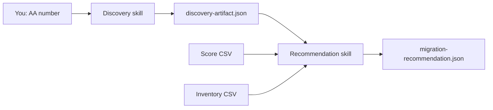

# Migration skills guide

This app uses two skills that work together to move legacy workloads toward AKS.

| # | Skill | What it does |
|---|--------|----------------|
| 1 | [Application discovery](./application-discovery.md) | Collect servers, apps, and questionnaire answers for an AA number |
| 2 | [Migration recommendation](./migration-recommendation.md) | Score suitability and suggest target AKS clusters |

**Run them in order.** Discovery produces `discovery-artifact.json`. Recommendation reads that file and adds scores + inventory.

## Quick example (Streamlit)

1. Start the app: `./start.sh`
2. Set bearer token to `1234` in the sidebar (mock API)
3. **Discovery:** `Discover application AA12345`
4. Answer questionnaire prompts and approve tool calls when asked
5. **Recommendation:** `Recommend migration targets for AA12345`

## Where files live

| Area | Path |
|------|------|
| Skill definitions (agent instructions) | `agent_workspace/skills/<skill-name>/` |
| Per-run outputs (your conversation) | `agent_workspace/runs/<thread_id>/<run_hash>/` |
| Questionnaire answers (per AA) | `agent_workspace/skills/application-discovery/questionnaires/` |
| Score & inventory data | `agent_workspace/skills/migration-recommendation/` |

## Related docs

- [Artifact isolation](../artifact-maintenance-system.md) — how run folders work
- [Project README](../../README.md) — setup and architecture
