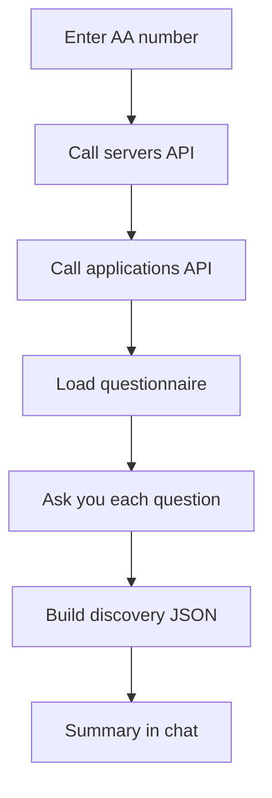

# Application discovery skill

Collect everything needed to understand an application before migration: servers, apps, questionnaire answers, and one consolidated JSON file.

## What you need

- An **AA number** in the form `AA12345` (`AA` + 5 digits)
- Bearer token **`1234`** in the Streamlit sidebar (mock API mode)
- App running via `./start.sh`

## What happens step by step



| Step | What the agent does | Your role |
|------|---------------------|-----------|
| 1. Collect AA | Validates `AA#####` | Provide AA number if not in your message |
| 2. Discover servers | Calls platform API | Approve API call (or use auto-approve) |
| 3. Find applications | Calls API per server | Approve API calls |
| 4. Questionnaire | Loads Excel template | Answer each question (dropdown or text) |
| 5. Build JSON | Merges API + questionnaire data | Approve file write if prompted |
| 6. Summarize | Writes canvas + replies in chat | Read the summary |

The UI shows a **progress stepper** while the skill runs (Collect AA → Discover servers → … → Summarize).

## Example prompts

```
Discover application AA12345
```

```
Run application discovery for AA54321
```

## Outputs (per conversation run)

Files are saved under `agent_workspace/runs/<thread_id>/<run_hash>/`:

| File | Contents |
|------|----------|
| `discovery-artifact.json` | **Main output** — servers, apps, questionnaire answers |
| `servers.json` | Raw servers API response |
| `applications.json` | Raw applications API responses |
| `canvas.md` | Human-readable notes and summary |
| `skill-progress.json` | Step status for the UI stepper |

## Questionnaire

- **Template:** `agent_workspace/skills/application-discovery/questionnaire.template.xlsx`
- **Your answers:** `agent_workspace/skills/application-discovery/questionnaires/{AA_CODE}.xlsx`

Columns in the Excel file:

| Column | Meaning |
|--------|---------|
| Question | Text shown to you |
| DropDownValues | Allowed answers separated by `/` (empty = free text) |
| Answer | Filled during discovery |

To add or change questions, edit the template. New AA numbers get a copy automatically; existing workbooks are not overwritten.

## Discovery JSON (`discovery-artifact.json`)

The canonical output shape is defined in:

- `agent_workspace/skills/application-discovery/discovery-artifact.schema.json` — structure
- `agent_workspace/skills/application-discovery/discovery-artifact.mapping.json` — how data is filled

Example structure:

```json
{
  "aa_code": "AA12345",
  "discovered_at": "2026-06-11T12:00:00+00:00",
  "infrastructure": {
    "servers": [ { "id": "1", "hostname": "app-server-01", "environment": "Prod" } ],
    "applications": [ { "id": "101", "name": "Customer Portal", "runtime": "Java 17" } ]
  },
  "questionnaire": {
    "responses": [ { "question": "...", "answer": "...", "answered": true } ]
  }
}
```

Replace the schema and mapping files when you connect to your real platform.

## Mock API (local dev)

| Endpoint | Purpose |
|----------|---------|
| `GET /mock/discovery/{aa_code}/servers` | List servers |
| `GET /mock/discovery/{aa_code}/servers/{server_id}/applications` | List apps on a server |

Base URL: `http://localhost:8000` — requires `Authorization: Bearer 1234`.

## Tool approvals

These actions may pause for your approval (unless **auto-approve** is on in the sidebar):

- `call_authenticated_api` — outbound API calls
- `write_file` / `edit_file` — saving JSON and canvas files

Questionnaire prompts always need your input — they are not auto-approved.

## Customization checklist

- [ ] Replace mock API URLs in `agent_workspace/skills/application-discovery/SKILL.md`
- [ ] Update `discovery-artifact.schema.json` for your platform
- [ ] Edit `questionnaire.template.xlsx` for your questions
- [ ] Set real bearer token in `.env` or Streamlit sidebar

## Next step

When discovery is complete, use the [migration recommendation](./migration-recommendation.md) skill in the **same conversation** so it can read `discovery-artifact.json`.
