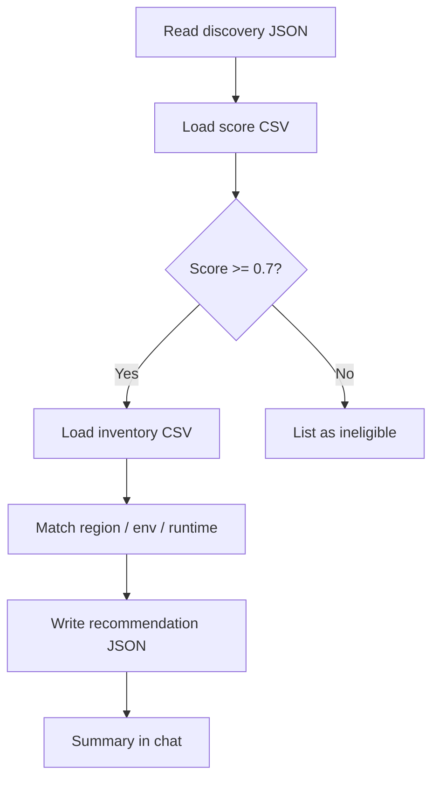

# Migration recommendation skill

Turn discovery data into concrete migration advice: which servers and apps are ready to move, and which AKS cluster fits each one.

## Prerequisite

Run **[application discovery](./application-discovery.md)** first in the same conversation. This skill needs:

```
agent_workspace/runs/<thread_id>/<run_hash>/discovery-artifact.json
```

If that file is missing, the agent will ask you to run discovery.

## What you need

- Completed `discovery-artifact.json` from the discovery skill
- **Migration scores** CSV (0.0–1.0 per server and application)
- **Target inventory** CSV (available AKS clusters)

Templates ship with the repo; you can edit them for your environment.

## What happens step by step



| Step | What the agent does |
|------|---------------------|
| 1. Load discovery | Reads `discovery-artifact.json` |
| 2. Load scores | Reads CSV suitability scores (0–1) |
| 3. Assess eligibility | Identifies entities at or above threshold (default **0.7**) |
| 4. Load inventory | Reads AKS cluster inventory CSV |
| 5. Build recommendation | Matches eligible items to clusters |
| 6. Summarize | Writes JSON + explains recommendations |

## Example prompts

```
Recommend migration targets for AA12345
```

```
Using the discovery artifact, which servers and apps are suitable for AKS migration?
```

```
Run migration recommendation with min score 0.8
```

## Score CSV

**Template:** `agent_workspace/skills/migration-recommendation/migration-scores.template.csv`  
**Per AA (created on first use):** `agent_workspace/skills/migration-recommendation/scores/{AA_CODE}.csv`

| Column | Example | Notes |
|--------|---------|-------|
| EntityType | `server` or `application` | |
| EntityId | `1`, `101` | Must match `id` in discovery JSON |
| EntityName | `app-server-01` | Display name |
| Score | `0.88` | **0.0 = not suitable, 1.0 = highly suitable** |
| Notes | Optional text | Why this score |

Example rows:

```csv
EntityType,EntityId,EntityName,Score,Notes
server,1,app-server-01,0.88,Strong containerization signals
application,101,Customer Portal,0.92,Java 17; good AKS fit
application,201,Reporting API,0.61,Below default threshold
```

Entities with score **below 0.7** (default) are listed as ineligible but still appear in the output for transparency.

## Inventory CSV

**Template:** `agent_workspace/skills/migration-recommendation/target-inventory.template.csv`  
**Working copy:** `agent_workspace/skills/migration-recommendation/target-inventory.csv`

| Column | Example | Notes |
|--------|---------|-------|
| Region | `DC-East` | Matches server `datacenter` from discovery |
| Environment | `Prod` | Matches server `environment` |
| ClusterName | `aks-prod-east-01` | Target AKS cluster |
| NodePool | `general` | |
| Capacity | `available` | `available`, `limited`, or `unavailable` |
| CpuCores / MemoryGb / StorageGb | `16` / `64` / `512` | Cluster sizing |
| PreferredRuntimes | `Java 17,Node.js 20` | Comma-separated |
| Notes | Optional | |

Matching logic (simplified):

1. Prefer same **region** and **environment**
2. Prefer clusters whose **PreferredRuntimes** fit the application runtime
3. Skip clusters marked `unavailable`

## Outputs (per conversation run)

| File | Contents |
|------|----------|
| `migration-recommendation.json` | **Main output** — eligible items, targets, ineligible list |
| `migration-canvas.md` | Optional human-readable summary |

Example recommendation entry:

```json
{
  "entity_type": "application",
  "entity_id": "101",
  "entity_name": "Customer Portal",
  "score": 0.92,
  "migration_suitable": true,
  "primary_recommendation": {
    "cluster_name": "aks-prod-east-01",
    "region": "DC-East",
    "environment": "Prod"
  }
}
```

Full shape: `agent_workspace/skills/migration-recommendation/recommendation.schema.json`

## Scoring threshold

Default minimum score: **0.7**

Ask the agent to use a different value, e.g. *"use min score 0.8"*. The tool `build_migration_recommendation` accepts a `min_score` parameter.

## Tool approvals

May require approval (unless auto-approve is on):

- `read_file` — reading discovery JSON
- `write_file` — saving `migration-recommendation.json`

Loading scores and inventory uses dedicated tools (`load_migration_scores`, `load_target_inventory`) and does not need separate file approval.

## Customization checklist

- [ ] Edit score CSV with your assessment model (0–1 per entity)
- [ ] Edit inventory CSV with your real AKS clusters
- [ ] Adjust default threshold in conversation or in `migration_recommendation_tool.py`
- [ ] Update `recommendation.schema.json` if your output format differs

## End-to-end flow (both skills)

```
1. Discover application AA12345     →  discovery-artifact.json
2. Recommend migration for AA12345  →  migration-recommendation.json
```

See the [skills overview](./README.md) for paths, UI tips, and links to other docs.
